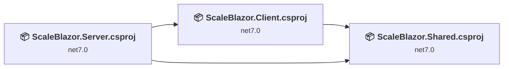
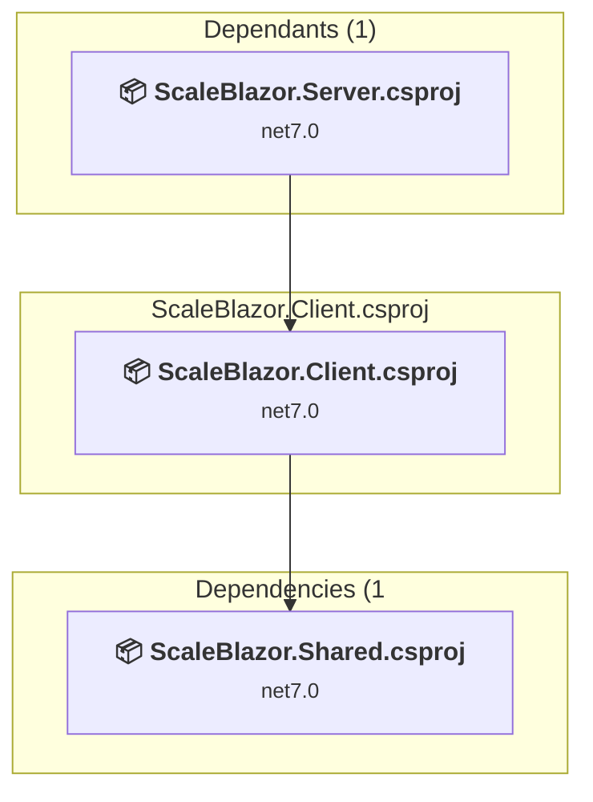
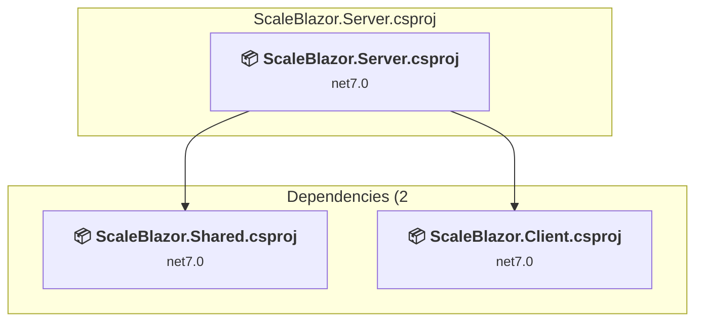
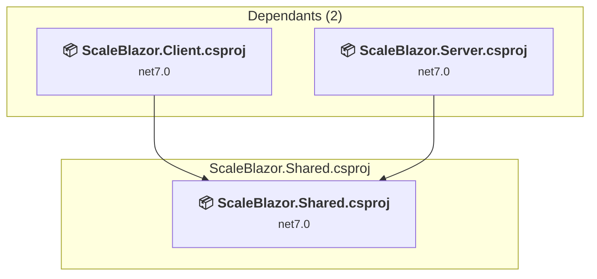

# Projects and dependencies analysis

This document provides a comprehensive overview of the projects and their dependencies in the context of upgrading to .NETCoreApp,Version=v10.0.

## Table of Contents

- [Executive Summary](#executive-Summary)
  - [Highlevel Metrics](#highlevel-metrics)
  - [Projects Compatibility](#projects-compatibility)
  - [Package Compatibility](#package-compatibility)
  - [API Compatibility](#api-compatibility)
- [Aggregate NuGet packages details](#aggregate-nuget-packages-details)
- [Top API Migration Challenges](#top-api-migration-challenges)
  - [Technologies and Features](#technologies-and-features)
  - [Most Frequent API Issues](#most-frequent-api-issues)
- [Projects Relationship Graph](#projects-relationship-graph)
- [Project Details](#project-details)

  - [ScaleBlazor\Client\ScaleBlazor.Client.csproj](#scaleblazorclientscaleblazorclientcsproj)
  - [ScaleBlazor\Server\ScaleBlazor.Server.csproj](#scaleblazorserverscaleblazorservercsproj)
  - [ScaleBlazor\Shared\ScaleBlazor.Shared.csproj](#scaleblazorsharedscaleblazorsharedcsproj)

## Executive Summary

### Highlevel Metrics

| Metric | Count | Status |
| :--- | :---: | :--- |
| Total Projects | 3 | All require upgrade |
| Total NuGet Packages | 7 | 6 need upgrade |
| Total Code Files | 21 |  |
| Total Code Files with Incidents | 10 |  |
| Total Lines of Code | 2319 |  |
| Total Number of Issues | 116 |  |
| Estimated LOC to modify | 107+ | at least 4.6% of codebase |

### Projects Compatibility

| Project | Target Framework | Difficulty | Package Issues | API Issues | Est. LOC Impact | Description |
| :--- | :---: | :---: | :---: | :---: | :---: | :--- |
| [ScaleBlazor\Client\ScaleBlazor.Client.csproj](#scaleblazorclientscaleblazorclientcsproj) | net7.0 | 🟢 Low | 3 | 18 | 18+ | AspNetCore, Sdk Style = True |
| [ScaleBlazor\Server\ScaleBlazor.Server.csproj](#scaleblazorserverscaleblazorservercsproj) | net7.0 | 🟢 Low | 3 | 89 | 89+ | AspNetCore, Sdk Style = True |
| [ScaleBlazor\Shared\ScaleBlazor.Shared.csproj](#scaleblazorsharedscaleblazorsharedcsproj) | net7.0 | 🟢 Low | 0 | 0 |  | ClassLibrary, Sdk Style = True |

### Package Compatibility

| Status | Count | Percentage |
| :--- | :---: | :---: |
| ✅ Compatible | 1 | 14.3% |
| ⚠️ Incompatible | 0 | 0.0% |
| 🔄 Upgrade Recommended | 6 | 85.7% |
| ***Total NuGet Packages*** | ***7*** | ***100%*** |

### API Compatibility

| Category | Count | Impact |
| :--- | :---: | :--- |
| 🔴 Binary Incompatible | 0 | High - Require code changes |
| 🟡 Source Incompatible | 90 | Medium - Needs re-compilation and potential conflicting API error fixing |
| 🔵 Behavioral change | 17 | Low - Behavioral changes that may require testing at runtime |
| ✅ Compatible | 6309 |  |
| ***Total APIs Analyzed*** | ***6416*** |  |

## Aggregate NuGet packages details

| Package | Current Version | Suggested Version | Projects | Description |
| :--- | :---: | :---: | :--- | :--- |
| Microsoft.AspNetCore.Components.WebAssembly | 7.0.19 | 10.0.6 | [ScaleBlazor.Client.csproj](#scaleblazorclientscaleblazorclientcsproj) | NuGet package upgrade is recommended |
| Microsoft.AspNetCore.Components.WebAssembly.DevServer | 7.0.19 | 10.0.6 | [ScaleBlazor.Client.csproj](#scaleblazorclientscaleblazorclientcsproj) | NuGet package upgrade is recommended |
| Microsoft.AspNetCore.Components.WebAssembly.Server | 7.0.19 | 10.0.6 | [ScaleBlazor.Server.csproj](#scaleblazorserverscaleblazorservercsproj) | NuGet package upgrade is recommended |
| Microsoft.EntityFrameworkCore.Sqlite | 7.0.20 | 10.0.6 | [ScaleBlazor.Server.csproj](#scaleblazorserverscaleblazorservercsproj) | NuGet package upgrade is recommended |
| Microsoft.Extensions.Http | 7.0.0 | 10.0.6 | [ScaleBlazor.Client.csproj](#scaleblazorclientscaleblazorclientcsproj) | NuGet package upgrade is recommended |
| MudBlazor | 6.21.0 |  | [ScaleBlazor.Client.csproj](#scaleblazorclientscaleblazorclientcsproj) | ✅Compatible |
| System.IO.Ports | 7.0.0 | 10.0.6 | [ScaleBlazor.Server.csproj](#scaleblazorserverscaleblazorservercsproj) | NuGet package upgrade is recommended |

## Top API Migration Challenges

### Technologies and Features

| Technology | Issues | Percentage | Migration Path |
| :--- | :---: | :---: | :--- |

### Most Frequent API Issues

| API | Count | Percentage | Category |
| :--- | :---: | :---: | :--- |
| T:System.IO.Ports.SerialPort | 18 | 16.8% | Source Incompatible |
| T:System.Net.Http.HttpContent | 9 | 8.4% | Behavioral Change |
| T:System.IO.Ports.StopBits | 8 | 7.5% | Source Incompatible |
| T:System.IO.Ports.Parity | 8 | 7.5% | Source Incompatible |
| M:System.TimeSpan.FromSeconds(System.Double) | 7 | 6.5% | Source Incompatible |
| P:System.IO.Ports.SerialPort.IsOpen | 7 | 6.5% | Source Incompatible |
| T:System.IO.Ports.Handshake | 6 | 5.6% | Source Incompatible |
| T:System.Uri | 5 | 4.7% | Behavioral Change |
| M:System.TimeSpan.FromMilliseconds(System.Double) | 2 | 1.9% | Source Incompatible |
| M:System.IO.Ports.SerialPort.Open | 2 | 1.9% | Source Incompatible |
| P:System.IO.Ports.SerialPort.RtsEnable | 2 | 1.9% | Source Incompatible |
| P:System.IO.Ports.SerialPort.DtrEnable | 2 | 1.9% | Source Incompatible |
| P:System.IO.Ports.SerialPort.WriteTimeout | 2 | 1.9% | Source Incompatible |
| P:System.IO.Ports.SerialPort.ReadTimeout | 2 | 1.9% | Source Incompatible |
| F:System.IO.Ports.Handshake.None | 2 | 1.9% | Source Incompatible |
| P:System.IO.Ports.SerialPort.Handshake | 2 | 1.9% | Source Incompatible |
| P:System.IO.Ports.SerialPort.StopBits | 2 | 1.9% | Source Incompatible |
| P:System.IO.Ports.SerialPort.Parity | 2 | 1.9% | Source Incompatible |
| P:System.IO.Ports.SerialPort.DataBits | 2 | 1.9% | Source Incompatible |
| P:System.IO.Ports.SerialPort.BaudRate | 2 | 1.9% | Source Incompatible |
| M:System.IO.Ports.SerialPort.#ctor(System.String) | 2 | 1.9% | Source Incompatible |
| F:System.IO.Ports.StopBits.One | 2 | 1.9% | Source Incompatible |
| F:System.IO.Ports.Parity.None | 2 | 1.9% | Source Incompatible |
| M:System.IO.Ports.SerialPort.ReadExisting | 2 | 1.9% | Source Incompatible |
| M:System.Uri.#ctor(System.String) | 1 | 0.9% | Behavioral Change |
| M:Microsoft.Extensions.DependencyInjection.HttpClientFactoryServiceCollectionExtensions.AddHttpClient(Microsoft.Extensions.DependencyInjection.IServiceCollection,System.String,System.Action{System.Net.Http.HttpClient}) | 1 | 0.9% | Behavioral Change |
| M:System.IO.Ports.SerialPort.Close | 1 | 0.9% | Source Incompatible |
| M:System.IO.Ports.SerialPort.GetPortNames | 1 | 0.9% | Source Incompatible |
| P:System.IO.Ports.SerialPort.BytesToRead | 1 | 0.9% | Source Incompatible |
| P:System.IO.Ports.SerialPort.PortName | 1 | 0.9% | Source Incompatible |
| M:Microsoft.AspNetCore.Builder.ExceptionHandlerExtensions.UseExceptionHandler(Microsoft.AspNetCore.Builder.IApplicationBuilder,System.Action{Microsoft.AspNetCore.Builder.IApplicationBuilder}) | 1 | 0.9% | Behavioral Change |

## Projects Relationship Graph

Legend:
📦 SDK-style project
⚙️ Classic project

## Project Details

### ScaleBlazor\Client\ScaleBlazor.Client.csproj

#### Project Info

- **Current Target Framework:** net7.0
- **Proposed Target Framework:** net10.0
- **SDK-style**: True
- **Project Kind:** AspNetCore
- **Dependencies**: 1
- **Dependants**: 1
- **Number of Files**: 13
- **Number of Files with Incidents**: 5
- **Lines of Code**: 175
- **Estimated LOC to modify**: 18+ (at least 10.3% of the project)

#### Dependency Graph

Legend:
📦 SDK-style project
⚙️ Classic project

### API Compatibility

| Category | Count | Impact |
| :--- | :---: | :--- |
| 🔴 Binary Incompatible | 0 | High - Require code changes |
| 🟡 Source Incompatible | 2 | Medium - Needs re-compilation and potential conflicting API error fixing |
| 🔵 Behavioral change | 16 | Low - Behavioral changes that may require testing at runtime |
| ✅ Compatible | 3626 |  |
| ***Total APIs Analyzed*** | ***3644*** |  |

### ScaleBlazor\Server\ScaleBlazor.Server.csproj

#### Project Info

- **Current Target Framework:** net7.0
- **Proposed Target Framework:** net10.0
- **SDK-style**: True
- **Project Kind:** AspNetCore
- **Dependencies**: 2
- **Dependants**: 0
- **Number of Files**: 12
- **Number of Files with Incidents**: 4
- **Lines of Code**: 2055
- **Estimated LOC to modify**: 89+ (at least 4.3% of the project)

#### Dependency Graph

Legend:
📦 SDK-style project
⚙️ Classic project

### API Compatibility

| Category | Count | Impact |
| :--- | :---: | :--- |
| 🔴 Binary Incompatible | 0 | High - Require code changes |
| 🟡 Source Incompatible | 88 | Medium - Needs re-compilation and potential conflicting API error fixing |
| 🔵 Behavioral change | 1 | Low - Behavioral changes that may require testing at runtime |
| ✅ Compatible | 2491 |  |
| ***Total APIs Analyzed*** | ***2580*** |  |

### ScaleBlazor\Shared\ScaleBlazor.Shared.csproj

#### Project Info

- **Current Target Framework:** net7.0
- **Proposed Target Framework:** net10.0
- **SDK-style**: True
- **Project Kind:** ClassLibrary
- **Dependencies**: 0
- **Dependants**: 2
- **Number of Files**: 9
- **Number of Files with Incidents**: 1
- **Lines of Code**: 89
- **Estimated LOC to modify**: 0+ (at least 0.0% of the project)

#### Dependency Graph

Legend:
📦 SDK-style project
⚙️ Classic project

### API Compatibility

| Category | Count | Impact |
| :--- | :---: | :--- |
| 🔴 Binary Incompatible | 0 | High - Require code changes |
| 🟡 Source Incompatible | 0 | Medium - Needs re-compilation and potential conflicting API error fixing |
| 🔵 Behavioral change | 0 | Low - Behavioral changes that may require testing at runtime |
| ✅ Compatible | 192 |  |
| ***Total APIs Analyzed*** | ***192*** |  |

